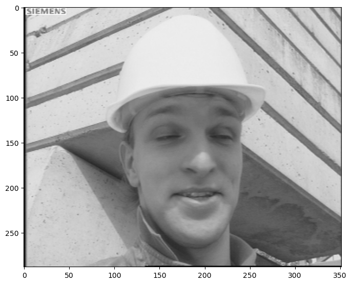
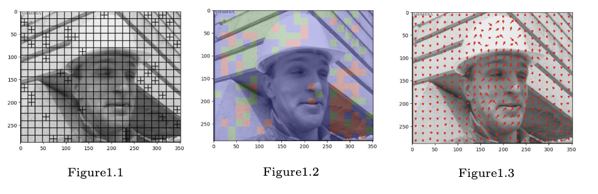
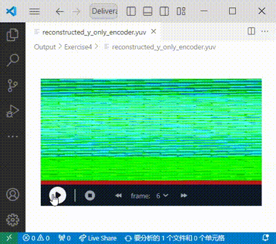

# Abstract

This project is a digital video codec system. By using a variety of different algorithms, the gains and losses of various trade-offs (various important parameters) are analyzed. Such as throughput, power consumption, cost, programmability, time to market, and application-specific aspects such as quality, target bit rate, latency, and error resilience.

# Description

Figure 1: Original_frame 
 

  

These images are visual examples of video encoding analysis, demonstrating various encoding features and decisions. The left image shows the selection of a P-frame or I-frame with variable block size decisions overlaid. The middle image depicts the support for multiple reference frames, with each block marked by a color or other indicator showing the index of the reference frame used. The right image displays a map of motion vectors (MVs) overlaid on an arbitrary P-frame, using innovative representations to visualize the direction and magnitude of the motion vectors. These images help to deeply understand and analyze key technologies in the video encoding process.

<<<<<<< Updated upstream

  
  
Figure 2: Six frames of Y component

=======
<<<<<<< HEAD

<figcaption>Figure 2: Six Frames of Reconsturcted Y component</figcaption>
>>>>>>> Stashed changes

=======

  <video width="45%" controls>
    <source src="reconstructed_y_only_encoder.mp4" type="video/mp4">
    Your browser does not support the video tag.
  </video>
  <figcaption>Figure 2: Six Frames of Reconstructed Y Component</figcaption>

>>>>>>> 74b4543366fe9470045028a611f7933dd750f41f

After decoding, it will generate a reconsturcted YUV file.  This figure shows 6 frames of Y component from YUV file .

